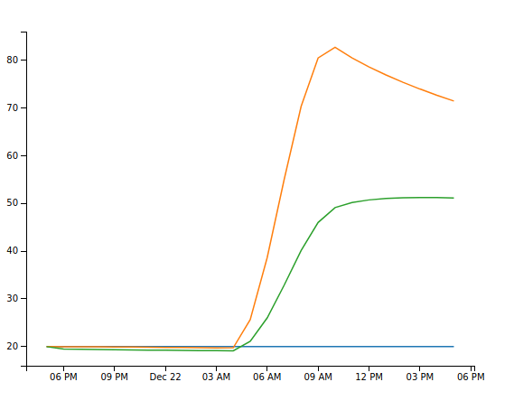

Quick start
==================

After installation of package you can use it in you code. For example:

file main.py:

.. code-block:: python

    import os

    import uuid

    import settings
    from solarhouse.building import Building
    from solarhouse.calculation import Calculation
    import solarhouse.export as export

    def main():
        calc = Calculation(
            tz=settings.TZ,
            geo=settings.GEO,
            building=Building(
                mesh_file=settings.PATH_FILE_OBJECT,
                geo=settings.GEO,
                wall_material=settings.WALL_MATERIAL,
                wall_thickness=settings.WALL_THICKNESS,
                start_temp_in=settings.TEMPERATURE_START,
                power_heat_inside=settings.POWER_HEAT_INSIDE,
                efficiency=settings.EFF,
                heat_accumulator={
                    'volume': 0.032,
                    'material': 'water',
                },
                windows={
                    'area': 0.3,
                    'therm_r': 5.0,
                },
                floor={
                    'area': 1.0,
                    'material': 'adobe',
                    'thickness': 0.2,
                    't_out': 4.0,
                },
            ),
                        )
        data_frame = calc.compute(date=22, month=12, year=2019, with_weather=False)
        calc_id = str(uuid.uuid4())
        output_dir = os.path.join(settings.PATH_OUTPUT, calc_id)
        os.makedirs(output_dir, exist_ok=True)
        csv_file_path = export.as_file(data_frame, 'csv', output_dir)
        export.as_html(data_frame, output_dir)

    if __name__ == "__main__":
        main()

file settings.py:

.. code-block:: python

    import os
    import pathlib

    _this_dir = pathlib.Path(__file__).parent.absolute()

    PATH_FILE_OBJECT = os.path.join(_this_dir, 'files/cube.obj')
    TIME_TICK = 1    #1 hours
    WALL_THICKNESS = 0.3
    TEMPERATURE_START = 20  #celcium
    POWER_HEAT_INSIDE = 0   #kWtt
    MASS_INSIDE = 500   #kg
    PATH_FILE_TEMPERATURE_OUTSIDE_FILE = os.path.join(_this_dir, 'files/temp_table.csv')
    PATH_EXPORT_THERMO_RESULT_FILE = os.path.join(_this_dir, 'files/results.csv')
    SPACE_POWER_ON_METER = 1000
    WALL_MATERIAL = 'adobe'
    EFF = 75        #in percents
    EFF_ANG = 85.0
    GEO = {
        'latitude': 54.841426,
        'longitude': 83.264479,
    }
    TZ = 'Asia/Novosibirsk'
    COUNT_FACES_FOR_PARALLEL_CALC = 1000
    PATH_OUTPUT = os.path.join(_this_dir, 'output')

All parameters of a house (mesh, thickness of wall, material of walls and etc.) sets in file settings.py

After that you can start calculation:

.. code-block:: bash

    $python3 main.py

As result you get two files in folder with calc_id name: data.csv and plot.html like on pictures:

