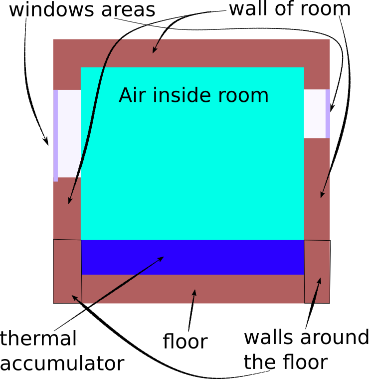
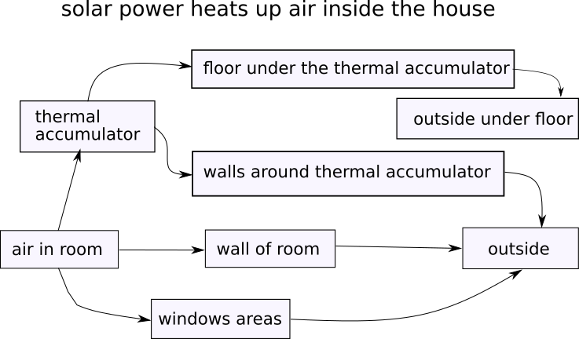
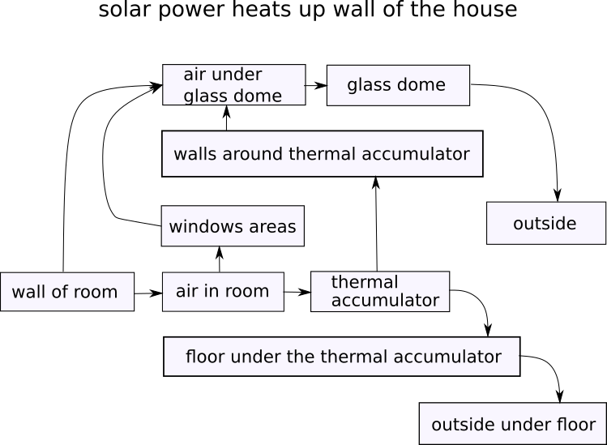
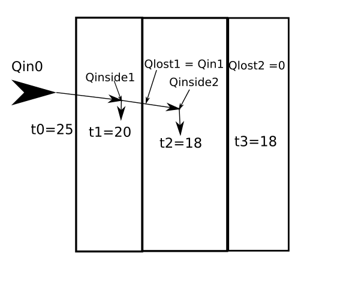
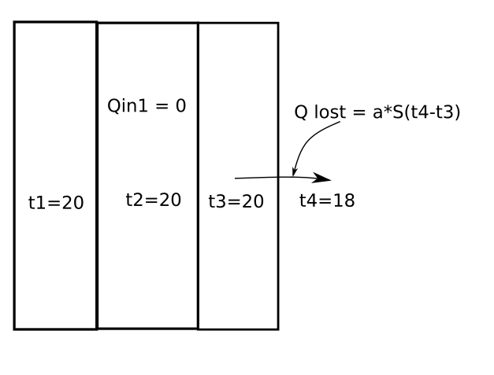

Thermal theory and Modeling.
=============================

Theory based on heat equation: `wiki <https://en.wikipedia.org/wiki/Heat_equation>`_

All procces heat spreading is described by the formula:

.. math:: du/dt =\alpha(d^2u/dx^2 + d^2u/dy^2+ d^2u/dz^2)

Calculations using this formula are very complex and time consuming.

This why needs to simplify calculations. For this we can create simple thermal  model of house.

Simple model of a house is a thermal shell with a massive object inside like on picture:

All elements of this model we can represent as a thermo point or a set of thermal layers.
For each elements where temperature distribution by element volume is not important can be considered a thermal point.
For example inside water thermal accumulator temperature distribution by element volume does very quickly.
For elements which situated in thermal shell of model of house needs to take into account the temperature distribution of the layers from the inside to outside.
Each of layers can be considered a thermal point.

For calculate all model needs to link all elements to scheme.

Depends of type of solar collectors the begin point of heat spreading can be thermal accumulator or air inside house.

Scheme of heat spreading from thermal accumulator:

.. image:: _static/schema1.png

Scheme of heat spreading from air inside:

Scheme of heat spreading from walls of house:

.. note::
    This model works best for regular convex house shapes.
    If the shape is not regular and has many protruding parts, then the model does not work well.

==================================================
Calculation of heat spreading from point to point
==================================================

The calculation is performed over a very small period of time. If the calculation is done for a layered element, then the layers are also very small.

Heat balance of each thermal point can be described by the formula:

.. math:: Qinside = cm(t2 - t1)

.. math:: Qlost =  \alpha*A(Tin - Tout)

.. math:: Qenter = Qinside + Qlost = cm(t2 - t1) + \alpha*A(Tin - Tout)

c - heat capacity of material of point;

m - mass of thermal point (or of one layer);

t2 - temperature in finish of dt;

t1 - temperature in begin of dt;

\alpha -  thermal diffusivity of material of point;

A - area of next element;

Tin  - temperature of current point on begin calculation;

Tout - temperature of next point on begin calculation;

On the follows pictures you can see process for some layers:

As you can see on picture heat which lost on first layer is a enter heat of second layer.

.. note::
    Calculation on each small period of time made on all thermal points and all layers from first element to finish element.
    Process running by scheme from point by point on each period of time.

Now in package we use only three scheme of elements.

.. note::
    Last element of each scheme is a temperature of outside.
    There are several last elements. For example temperature outside can be not equal temperature under floor of house.

And the last assumption that we make in the calculations is that the area of layers in layered elements does not change from inside to outside.

Such an assumption is justified with a thin wall relative to the linear dimensions of the house.

If you set thick walls with small size house you get wrong result of thermal calculation.

As result if has all described above assumption you can get approximate result of temperature inside the a house.

From this you can estimate how much the heating season will be reduced.